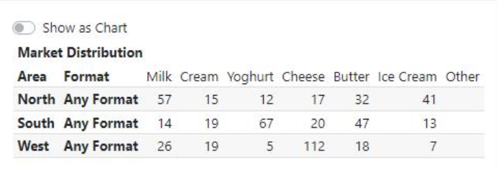
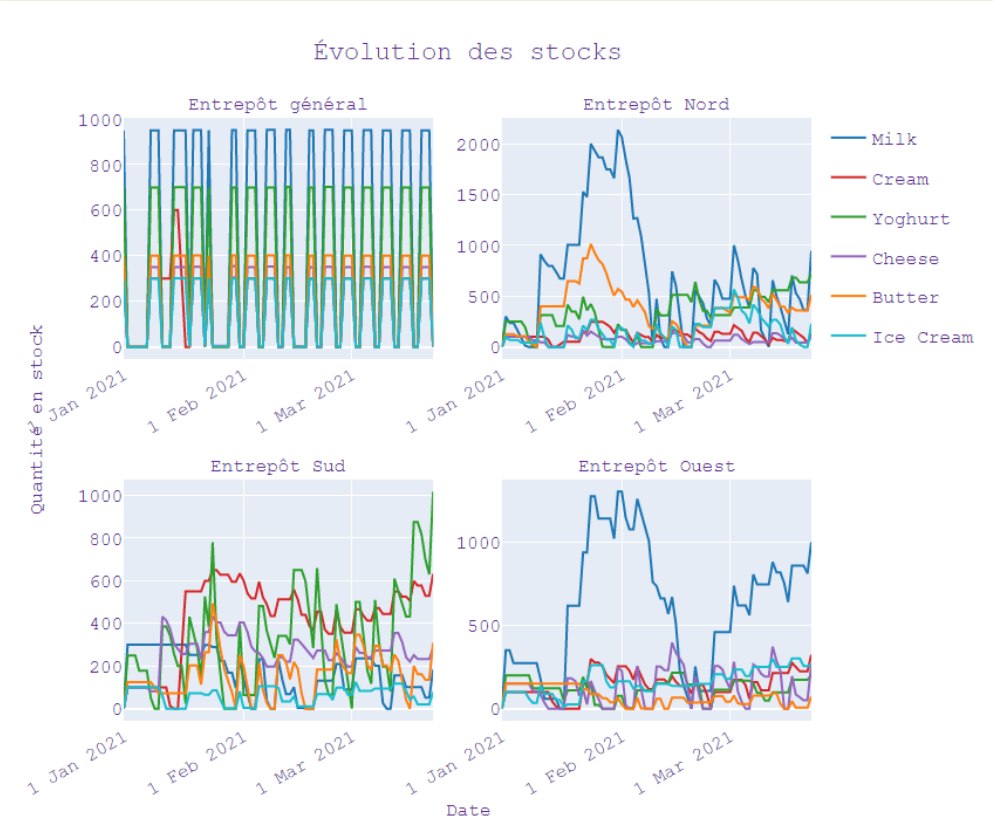

.. _bilan_projet:

******************
Histoire du Projet
******************

===================
Démarrage du projet 
===================

Le but du projet était de créer une Intelligence Artificielle capable de jouer et de gagner à *ERPSIM*. 

Pour ce faire, nous avons lu et mis de côté les informations importantes des guides d'utilisation fournis par HEC Montréal 
afin de faire un condensé des informations à retenir. Nous avons aussi joués plusieurs parties, pour se familiariser au 
fonctionnement du jeu, pour voir quelles données étaient présentes sur l'interface du jeu, mais aussi pour voir de quoi était 
composé le flux oData. En effet, le flux oData est le flux sur lequel nous extrayons les données. 

Etat de l'Art
-------------

Nous avons réalisé une introduction sur les méthodes employées pour créer une intelligence artificielle dans le cadre de la théorie des jeux. Nous n'avons pas détaillé les différentes méthodes utilisées dans ce cadre puisque nous avons laissé de côté cette éventualité suite à une étude plus approfondie du système ERPSIM. |br| 
Nous allons vous expliquer pourquoi.

^^^^^^^^^^^^^^^^^^^^^^
Reinforcement Learning
^^^^^^^^^^^^^^^^^^^^^^

Lorsque l'on aborde le sujet de l'intelligence artificielle permettant de battre l'intelligence humaine dans le cadre de jeux, nous pensons incontestablement à la défaite du champion du monde d'échec Kasparov contre une méthode d'intelligence artificielle en 1997. |br|
Nous pensons également au programme AlphaGo développé par DeepMind, ayant battu le champion du monde de Go en 2017. |br|
Ces méthodes utilise un sous-ensemble du domaine de l'intelligence artificielle appelé le `Reinforcement Learning <https://en.wikipedia.org/wiki/Reinforcement_learning>`_.

Nous avons donc effectué des recherches concernant ces méthodes. |br|
Nous allons vous expliquer rapidement l'objectif général de celles-ci afin de mieux comprendre ces problématiques. |br|
Le but du Reinforcement Learning est d'apprendre un comportement optimal ou presque optimal afin de maximiser la récompense reçue par le système (celle-ci étant déterminée par le développeur afin d'orienter l'apprentissage du système). |br|
L'agent intéragit avec l'environnement, il reçoit l'état de celui-ci, puis prend une décision parmi plusieurs actions possibles et reçoit suite à cet action, une récompense lui permettant par la suite d'adapter son comportement.

^^^^^^^^^^^^^^^^^^^^^^^^^^^^^^^^^^^^^^^^^^^^^^^^^^^^^^^^^^^^^^^^^^^^^^^
Contraintes nous ayant freinées dans l'emploi du Reinforcement Learning
^^^^^^^^^^^^^^^^^^^^^^^^^^^^^^^^^^^^^^^^^^^^^^^^^^^^^^^^^^^^^^^^^^^^^^^

Nous voyons donc que ces méthodes nécessitent de pouvoir intéragir avec un environnement. |br|
Notre environnement dans ce cas-ci, est l'environnement ERPSIM. Nous avons donc cherché comment intéragir avec celui-ci.

Tout d'abord, nous devons être capable de lancer via une instruction de code, le début d'une partie. |br|
Il y a alors une première contrainte puisque seul le professeur semble capable de pouvoir démarrer une partie.

Ensuite, nous devons être capable avec des instructions de code, d'effectuer une action sur l'environnement ERPSIM (ie. baisser le prix d'un produit). |br|
Nous avons alors cherché de quelle manière l'interface SAP Fiori intéragit avec SAP 4/HANA. |br|
L'interface ERPSIM développée à l'aide de SAP Fiori, semble intéragir avec SAP HANA via des services OData. |br| 
Cependant, sans avoir de spécifications concernant ces services et comment les utiliser, il est difficile de pouvoir programmatiquement intéragir avec SAP HANA directement. |br|
Nous avons essayé de faire du reverse engineering [#f2]_ de l'app Fiori, mais n'avons pas compris comment pouvoir intéragir directement avec SAP HANA. |br|
Nous pouvons récupérer les informations sur la partie via le flux OData fourni ou encore par les `CDS Views de SAP <https://help.sap.com/docs/SAP_HANA_PLATFORM/b3d0daf2a98e49ada00bf31b7ca7a42e/b4080c0883c24d2dae38a60d7fbf07c8.html?version=2.0.04&locale=en-US>`_. 

.. figure:: _static/img/CompanyValuationRequest.png
    :align: center 
    :target: ../_images/CompanyValuationRequest.png

    *Reverse Engineering de la récupération des données de la Company Valuation*

Résultats de la requête :

.. code-block:: console

    {
        "d": {
            "results": [
                {
                    "__metadata": {
                        "id": "https://e03lp1.ucc.in.tum.de:8100/sap/opu/odata/sap/ZCDS_V_SSB_COMPVAL_CDS/ZCDS_V_SSB_COMPVAL('.10~EUR')",
                        "uri": "https://e03lp1.ucc.in.tum.de:8100/sap/opu/odata/sap/ZCDS_V_SSB_COMPVAL_CDS/ZCDS_V_SSB_COMPVAL   ('.10~EUR')",
                        "type": "ZCDS_V_SSB_COMPVAL_CDS.ZCDS_V_SSB_COMPVALType"
                    },
                    "CURRENCY": "EUR",
                    "DELTA": "1470997.90"
                }
            ]
        }
    }

On voit que SAP Fiori récupère les données de SAP 4/HANA via les CDS Views servies par un service OData.

Mais lorsqu'il s'agit d'effectuer des actions comme changer les prix des produits, nous n'avons pas réussi à cibler quelles requêtes effectuent ces actions avec certitude, ni comment les utiliser.

.. figure:: _static/img/ChangeConditionsRequest.png
    :align: center 
    :target: ../_images/ChangeConditionsRequest.png

    *Reverse Engineering de l'action changement de prix*

Payload de la requête :

.. code-block:: console

    [
        {
            "content":"3.90",
            "post":"value/wnd[0]/usr/ssubUEBERSICHT_SUB1:SAPMV13A:3011/tblSAPMV13ATCTRL_D3011/txtKONP-KBETR[2,1]"
        },
        {
            "post":"action/304/wnd[0]/usr/subHEADER:SAPLV13F:0100/txtLV13F-VAKET3",
            "content":"position=0",
            "logic":"ignore"
        },
        {
            "post":"focus/wnd[0]/usr/subHEADER:SAPLV13F:0100/txtLV13F-VAKET3",
            "logic":"ignore"
        },
        {
            "post":"action/3/wnd[0]/tbar[0]/btn[11]"
        },
        {
            "get":"state/ur"
        }
    ]

Nous n'avons pas compris comment pouvoir utiliser ces requêtes pour comprendre comment intéragir avec SAP HANA.

Nous avons donc conclu, qu'il ne serait pas possible sans de plus amples connaissances sur SAP HANA et Fiori de pouvoir intéragir directement avec SAP HANA, et donc de développer un système d'intelligence artificielle par renforcement.

^^^^^^^^^^^^^^^^^^^^^^^^^^^^^^^^^^^^
Conclusion sur la méthode à employer
^^^^^^^^^^^^^^^^^^^^^^^^^^^^^^^^^^^^

Suite à ces conclusions, nous avons alors décidé de proposer une solution d'aide au joueur, qui lui permettrait d'avoir une vue plus concise de la situation de son entreprise, et de le conseiller sur les stocks à envoyer dans les différents entrepôts, ainsi que quels prix appliquer pour chaque produit dans le scénario Logistics Introduction, qui nous permet de proposer une première approche répondant à la problématique qui est de créer un système intelligent capable de jouer à ERPSIM.

.. _paramètres_jeu:

Les paramètres du jeu 
---------------------

Nous avons répertoriés les paramètres du jeu. Nous savons que nous pouvons agir sur les prix, les flux de transferts. En agissant sur ces derniers, 
nous influons les ventes et les stocks : 

.. figure:: _static/img/ParamètresERPSIM.png
    :align: center 
    :target: ../_images/ParamètresERPSIM.png

    *Liste des paramètres d'entrées et de sortie du jeu ERPSIM*

============================
Construction de la stratégie
============================

Nous avons alors commencé à élaborer des stratégies, dans le but de comprendre le fonctionnement du jeu, les paramètres essentiels pour 
avoir une bonne *company valuation* et donc un bon score. 

Stratégie de découverte : La stratégie du produit unique
--------------------------------------------------------

L'une d'elles consistait à se contenter d'un seul produit. Nous sommes 7 dans le groupe, nous avons donc joué à 6, et une personne
centralisait tout. Nous étions chacun affecté à un seul et unique produit, nous ne devions toucher à aucun autre produit, que ce soit
pour le stock ou pour le prix. Le but de cette manipulation était de comprendre comment les produits se vendaient. Nous essayions aussi
dans la limite du possible, de ne pas changer de prix trop régulièrement de manière à voir si les ventes variaient avec un prix fixe
ou non. 

^^^^^^^^^^^^^^^^^^^^^^^
Stratégie mise en place 
^^^^^^^^^^^^^^^^^^^^^^^

* Saturation des dépôts : On ne doit pas avoir de rupture de stock
* Modifications jour par jour des prix des produits et observation de l'impact sur les ventes

^^^^^^^^^
Objectifs 
^^^^^^^^^

1. 12 000 € de Chiffre d'affaire / Jour 
2. Maximiser les ventes par produit 

=> Trouver le prix d'équilibre entre garantir des ventes et maximiser le CA |br|
=> Optimiser :math:`y(p) = x(p) * q(p)` 

avec 

* :math:`y(p)` Le chiffre d'affaire par produit 
* :math:`x(p)` Le prix du produit 
* :math:`q(p)` La quantité vendue du produit 

^^^^^^^^^^^^^^^
Mode opératoire 
^^^^^^^^^^^^^^^

* Rounds 1 à 4 : 
    * Augmenter de 60 % le prix de tous les produits sauf le sien
    * Chacun devra relever jour par jour le prix et le nombre de ventes de son produit 
    * Si le produit :math:`x(p) * q(p)` est supérieur à la veille : 
        * réitérer la dernière variation de prix
        * sinon faire l'inverse de façon plus progressive 
    * ATTENTION, il faut faire le nécessaire pour que les dépôts ne soient jamais vides pour le produit que l'on étudie
        * Si nécessaire, la capacité des dépôts peut être excédée
    * A la fin des 4 rounds, mise en commun
* Round 5 : 
    * Chacun va adapter ses prix avec les prix d'équilibre trouvés par les autres équipes, cela permettra, en observant les données oData, de savoir si le marché est bien indépendant des autres. 

^^^^^^^^^^
Conclusion
^^^^^^^^^^

Cette stratégie nous a permis de conclure 3 choses. |br|
La première confirme le fait que les marchés sont bien indépendants entre les équipes. En effet, le jeu en mode Logistics Introduction, possède une option pour avoir un marché unique pour toutes les équipes ou un marché par équipe. Pour cette dernière option, il faut noter que les marchés de chaque équipe sont identiques, seulement si l'équipe A vend beaucoup, l'équipe B peut aussi vendre beaucoup. Les ventes ne sont pas réparties entre les équipes, contrairement à la première option. 

Ce choix avait été fait pour faciliter la compréhension du jeu dans un premier temps. 

La deuxième conclusion à tirer de cette expérience, est qu'un produit, à un prix donné, ne se vend pas du tout de la même manière en fonction des jours 
même si aucun paramètre ne change (prix ou stock). Cette fluctuation est donc à prendre en compte pour notre stratégie finale afin de conseiller le joueur 
non pas sur ses ventes de la veille, mais sur les ventes des jours précédents. Le nombre de jours de ventes à prendre en compte dans la stratégie reste à
définir. 

La troisième conclusion : il faut éviter d'avoir trop de stocks et de tomber en rupture de stock, car on ne fait plus de profit, la Company Valuation chutte alors fortement.

Stratégie d'ERPSIM Helper
-------------------------

La stratégie doit générer 2 tableaux permettant à l'utilisateur de savoir 
quelles actions effectuer sur les 2 paramètres modifiables du scénario Logistics Introduction du jeu ERPSIM :

* Un tableau retournant l'information de la quantité de stock à envoyer dans chaque entrepôt pour chaque produit
* Un autre tableau nous disant à quel prix vendre chaque produit

L'aide ERPSIM helper retranscrira également les aides sous forme de phrases aidant le joueur à interpréter ces tableaux.

^^^^^^^^^^^^^^^^^^^^^^^^^^^^^^^^^^^^^^^^^^^^^^^^^^^^^^^^^^^^^^^
Calcul de la prédiction des stocks à envoyer dans chaque région
^^^^^^^^^^^^^^^^^^^^^^^^^^^^^^^^^^^^^^^^^^^^^^^^^^^^^^^^^^^^^^^

Répartition des ventes
""""""""""""""""""""""

Afin de savoir quelle quantité de chaque produit envoyer dans chaque entrepôt, nous devons nous baser sur la demande Client. |br|
L'information nous permettant de déduire quelle est la demande pour chaque produit, est l'historique des ventes. |br|
Nous calculons alors la quantité de ventes du produit dans la région puis le divisons par 
la quantité de ventes de ce produit dans toutes les régions, 
ce qui nous donne une proportion de ventes pour chaque région Nord, Sud et Ouest.

:math:`proportion \, des \, ventes \, de \, p \, dans \, la \, région \, r = \frac{ventes_{p,r}}{ventes_{p}} = \% \, ventes_{p,r}`

Avec :

* :math:`p` : Le produit
* :math:`r` : La région

Cette proportion nous aide à savoir combien envoyer dans chaque région pour chaque produit.

Calcul de la quantité à envoyer dans chaque région
""""""""""""""""""""""""""""""""""""""""""""""""""

Nous calculons ensuite, combien envoyer de l'entrepôt principal aux entrepôts régionaux de la manière suivante : |br|

:math:`\forall p \in produits\quad \forall r \in régions`

Si
    :math:`\% \, ventes_{p,r} * stock_{p,entrepôt \, principal} > stock_{p,r}`

Alors
    On envoie :math:`\% \, ventes_{p,r} * stock_{p,entrepôt \, principal} - stock_{p,r}`

Sinon
    :math:`0` : Nous n'envoyons rien car nous avons assez de stock dans l'entrepôt régional.
    Les entrepôts régionaux qui sont plus dans le besoin seront grâce à cela, plus réapprovisionnés que celui-ci.

:math:`\forall p \in produits`

    Nous envoyons le reste du stock de l'entrepôt principal en le dispatchant proportionnellement à :math:`\% \, ventes_{p,r}`

Cette stratégie permet d'envoyer le nombre de produits dans chaque région proportionnellement à la demande dans chacune de celles-ci.

^^^^^^^^^^^^^^^^^^^^^^^^^^^^^^^^^^^^^^^^^^^^^^
Calcul du prix à appliquer pour chaque produit
^^^^^^^^^^^^^^^^^^^^^^^^^^^^^^^^^^^^^^^^^^^^^^

Nous utilisons pour calculer cela :

* Les ventes passées afin de savoir combien nous vendons par jour en moyenne
* Les prix actuels, pour savoir à combien, nous vendons actuellement nos produits
* La fréquence de réapprovisionnement du scénario (5 par défaut pour le scénario Logistics Introduction) et le jour courant dans ce cycle permettant de calculer le nombre de jours restants avant le prochain réapprovisionnement.
* Les stocks actuels

:math:`\forall p \in produits\quad \forall r \in régions`

**Si** le nombre moyen de ventes par jour > au stock restant par jour jusqu'au prochain réapprovisionnement
    
    On augmente le prix de 10%.

**Sinon si** le nombre moyen de ventes par jour < 80% du stock restant par jour restant avant le prochain réapprovisionnement, nous ne vendons pas assez

    **Alors si** 0.9 * le prix actuel du produit > prix de revient

        Nous baissons le prix de 10% pour vendre plus.

    **Sinon**

        Nous ne baissons pas le prix pour ne pas vendre à perte.

**Sinon**

    Nous laissons les prix actuels.

Nous avons fixé à 10% dans un premier temps pour simplifier la complexité du problème, et pour simplifier les manipulations du joueur. |br|
Une amélioration possible de la stratégie serait de trouver une méthode pour estimer ce pourcentage, avec par exemple les NPS Surveys.

.. _resultats:

====================================
Résultats et Analyse de la stratégie
====================================

Les bénéfices pour l'utilisateur
--------------------------------

D'un point de vue visuel, nous pouvons trouver, sur :ref:`l'interface utilisateur <joueur>`, des conseils sur les prix, les transferts de stocks, et une vue plus générale 
de l'état de l'entreprise au premier coup d'oeil. Cette vue permet de prendre des décisions plus rapidement puisque toutes les informations sont centralisées.

D'un point de vue contenu, nous pouvons changer très rapidement les transferts de Stocks grâce au tableau présent en bas à gauche de la page 
car les lignes des produits sont dans le même ordre que dans le jeu, ainsi que les colonnes pour les régions. De ce fait, le joueur n'a plus 
qu'à recopier les valeurs présentes dans ce tableau. 

De la même manière, le tableau des prix, en bas à droite de la page, permet d'adapter les prix au plus vite. Attention toutefois à la latence 
qu'il peut y avoir entre ERPSIM et ERPSIM Helper. En effet, le temps que les données soient récupérées et affichées sur l'interface, il se peut 
qu'un jour soit passé sur ERPSIM. Il faut donc bien vérifier sur ERPSIM Helper, le Round et le Jour en cours, de manière à pas changer le prix 
deux fois. 

Méthode d'évaluation
--------------------

Afin d'évaluer notre solution, nous voulions tester de faire une partie avec :

* Un joueur débutant
* Un joueur disposant des graphiques
* Un joueur disposant des graphiques et de l'aide

Cependant, à notre retour pour effectuer la période de 2 semaines en mai, le professeur nous a informé que l'on ne pouvait plus lancer des parties avec plusieurs joueurs (car diminution de la licence lorsqu'il n'y a plus de cours).

Nous avons donc décidé de mesurer l'efficacité de notre solution de la manière suivante :

1. Nous jouons une partie le plus parfaitement possible en suivant l'aide, puis mettons à disposition nos résultats, afin qu'une future partie du scénario Logistics Introduction puisse être jouée avec les mêmes paramètres de marché pour voir l'efficacité de notre solution comparé à un joueur novice.

    *Ditribution du marché de la partie jouée*

2. Pour avoir une intuition de l'efficacité de notre solution, nous comparons nos résultats avec ceux d'un groupe d'étudiants de `Junia ISA <https://www.isa-lille.fr/isa-lille/>`_ dont nous avons pu récupérer les flux odata. |br| Ils jouaient sur un autre scénario avec celui sur lequel nous avons joué. Nous savons donc que ces conclusions sont à prendre avec parcimonie. Ils nous permettent, cependant, d'avoir une indication sur le comportement de notre programme, sans pour autant valider les résultats.

Résultats finaux
----------------

En termes de Company Valuation, nous pouvons voir ci-dessous, que cette dernière monte très vite au départ puis se stabilise à une bonne valeur. 

.. figure:: _static/img/Game48-CompanyValuation.png
    :align: center
    :target: ../_images/Game48-CompanyValuation.png

    *Company Valuation d'une partie jouée avec ERPSIM Helper*

On y voit donc que nous atteignons 1 million de Company Valuation au Jour 4 du Round 2, et nous ne repassons plus jamais en dessous dans le reste de 
la partie. Au terme de la partie, nous réussissons à avoir 1.47 millions de Company Valuation avec un pic à 1.49 millions au jour 8 du Round 8. 

1. Par rapport aux autres parties que nous avons pu jouer au cours de ce projet, c'est largement cette partie qui a été la mieux jouée avec la meilleure Company Valuation. Notre aide paraît donc fiable. 

2. Qui plus est, nous avons comparé notre score aux parties des étudiants de `Junia ISA <https://www.isa-lille.fr/isa-lille/>`_. Nous sommes bien conscients que nous jouons à ERPSIM avec le scénario Logistics Introduction et que les autres étudiants jouent au scénario Extended et que la difficulté n'est pas la même, mais nous arrivons, avec ce score, à nous placer 3ème du classement. |br| Ce dernier résultat est vraiment à prendre avec précaution, le calcul de la Company Valuation n'est pas le même dans ces deux scénarios. De plus, nous ne savons pas si la Company Valuation est "plafonnée" par un jeu parfait, qui pourrait différer en fonction des variables initiales de la partie. |br| Cette remarque est donc là pour information, plus que pour montrer l'intérêt de notre solution.

Analyse de la stratégie
-----------------------

    *Etat des entrepôts lors de la partie jouée avec ERPSIM Helper*

Notre stratégie nous permet de ne pas accumuler de stock dans l'entrepôt général. 

Concernant les entrepôts régionaux, nous pouvons voir que la majorité des stocks sont bien gérés. |br|
Cependant, nous constatons que certains produits semblent saisonniers (i.e Milk), nos calculs permettant de savoir quelle quantité envoyer dans chaque région est basé sur les ventes depuis le début de la partie. |br| 
La stratégie ne prend donc pas en compte les effets saisonniers, on voit alors qu'après une période de forte vente dans l'Ouest, le Milk est réapprovisionné à tort dans l'Ouest.

Sur la Company Valuation, la stratégie semble bonne, même si elle peut sûrement être perfectionnée, en anticipant de manière plus intelligente, les variations de la demande Client. Une des pistes possible est d'exploiter les NPS Surveys.

==========================================
Développement de la solution ERPSIM Helper
==========================================

Répartition des tâches
----------------------

Pour réaliser le programme du projet, nous nous sommes répartis en 3 groupes : 

* Une partie pour l'extraction des données brutes 
* Une partie création d'une stratégie et réalisation des dashboard de visualisation 
* Une partie création des formulaires administrateur et player. 

Les différentes parties de ce projet ont été crées sur un `GitHub <https://github.com/Thrynk/ERPsim-helper>`_. 

Critères de récupération du flux oData 
--------------------------------------

La récupération des données est une étape indispensable pour réaliser notre aide. Nous avons donc réaliser un découpage en fonctions 
principales et fonctions contraintes afin de développer cette extraction de la meilleure des manières. 

* FP 1 : Extraire les données du flux oData 
* FP 2 : Stocker les données dans une base de données (afin de pouvoir analyser les parties une fois jouées sans être impacté par les changements de scénario du professeur). 

* FC 1 : L'authentification du joueur doit se faire avec ses identifiants ERPSIM pour se connecter au flux oData
* FC 2 : Le rechargement doit s'opérer de manière automatique 
    * FC 2.1 : Les rechargements doivent se faire jusqu'à la fin de la partie, quelque soit la durée de la partie 
    * FC 2.2 : Les rechargements doivent se mettre en pause si l'enseignant met en pause la partie
    * FC 2.3 : Les rechargements doivent se remettre en marche quand l'enseignant relance la partie après une pause 
    * FC 2.3 : Les rechargements doivent s'arrêter si on atteint le Jour 10 du Round 8
* FC 3 : Le processus d'extraction et de stockage des données doit prendre moins d'une minute. 
* FC 4 : La base de données doit être disponible le plus longtemps possible

^^^^^^^^^^^^^^^^^^^^
Choix architecturaux
^^^^^^^^^^^^^^^^^^^^

Une fois les données stockées, nous devons les contextualiser par partie, et associer l'utilisateur aux données de sa partie. |br|
Nous avons pour cela, décidé d'utiliser Django Server. |br| 
En effet, les modèles Django permettent de créer des tables dans une base de données, et de les alimenter. Django permet aussi, de gérer l'authentification des utilisateurs via un formulaire personnalisable.

En plus de Django, nous avons utilisé `Huey <https://huey.readthedocs.io/en/latest/>`_. |br|
Cette bibliothèque, s'associant avec Django, permet de créer des tâches de rechargements planifiées. |br| 
Nous pouvions grâce à cela, créer les tâches de rechargements pour chaque table du flux, et les lancer en parralèle, avec du multi-threading, de manière à augmenter la rapidité de l'extraction. |br|
Huey nous permet aussi de `scheduler` les tâches, pour les exécuter tous les :math:`x` minutes. |br|
Huey, pour stocker les tâches utilise `Redis <https://redis.io/>`_. |br|

Pour stocker les données, nous avons choisi d'utiliser une base MySQL, qui est utilisable avec Python grâce à la librarie `mysql-connector-python <https://dev.mysql.com/doc/connector-python/en/>`_. |br|
MySQL est une base relationnelle avec laquelle nous avons des connaissances et permettant de stocker des données tabulaires relationnelles comme les données venant du flux OData.

Enfin, pour extraire les données du flux oData, nous avons utilisé la librairie `pyodata <https://github.com/SAP/python-pyodata>`_, nous permettant de faire des requêtes au flux OData simplement.

Cette solution nous permet de mettre en place la synchronisation avec le flux OData, dans les temps impartis afin de pouvoir rapidement tester la stratégie.

Critères pour l'affichage des graphiques
----------------------------------------

Pour la partie affichage des graphiques, 

* FP 1 : Afficher l'évolution des stocks de l'entrepôt général ainsi que des entrepôts régionaux
* FP 2 : Afficher les ventes de chaque produit pour chaque région
* FP 3 : Afficher un tableau décrivant comment répartir les stocks de l'entrepôt principal
* FP 4 : Afficher un tableau décrivant comment modifier les prix des produits 

* FC 1 : La page ne doit pas s'alourdir au fil des Jours
* FC 2 : La page doit se rafraîchir en moins de 10 secondes
* FC 3 : La page ne doit pas "ne pas répondre" pendant l'actualisation des données

^^^^^^^^^^^^^^^^^^^^
Choix architecturaux
^^^^^^^^^^^^^^^^^^^^

Nous avons décidé d'utiliser la librairie `plotly <https://plotly.com/>` afin de créer des graphiques interactifs en Python puis de les envoyer depuis Django au navigateur Web. |br|
Cette librairie open-source nous permet d'afficher des graphiques qui puissent être intéractifs afin de pouvoir filtrer par produit car nos graphiques risquaient d'être chargés si l'on avait pas la possibilité de filtrer par produit. |br|
Elle s'intègre également facilement avec Django et Pandas (nous permettant de faire des calculs facilement sur les données).

Critères pour la stratégie conseillée
-------------------------------------

* FP 1 : La stratégie doit permettre au joueur d'avoir une meilleure Company Valuation

* FC 1 : La stratégie ne doit pas faire vendre à perte
* FC 2 : La stratégie doit limiter au maximum les ruptures de stocks 
* FC 3 : La stratégie doit adapter le stock dans les entrepôts régionaux en fonction des ventes de chaque région 
* FC 4 : Le calcul de la stratégie doit prendre moins de 30 secondes

^^^^^^^^^^^^^^^^^^^^
Choix architecturaux
^^^^^^^^^^^^^^^^^^^^

Pour la stratégie, nous avons décidé d'utiliser la librairie Pandas afin de pouvoir effectuer nos calculs facilement sur les données de la partie.

.. _difficultees:

========================
Difficultées rencontrées
========================

La complexité de SAP
--------------------

SAP, est difficile à comprendre pour un public non averti comme nous. |br|
Nous avions peu de temps pour réaliser la partie fonctionnel du projet, nous avions peu de marge de manoeuvre, nous permettant de faire des recherches sur SAP. |br|
Une grande partie de notre temps consacré à l'apprentissage de nouvelles connaissances a été dédié au jeu *ERPSIM*. |br|
Nous avons du jouer plusieurs parties afin de comprendre le mécanisme du jeu, mettre en évidence les :ref:`paramètres du jeu <paramètres_jeu>`. 
Nous avons aussi essayé de comprendre ce qui influençait la *company valuation* qui est ni plus ni moins que notre score sur le jeu en essayant différentes stratégies. 

Les simulations / Lancements des parties
----------------------------------------

Le projet, au stade initial, consistait à développer une Intelligence Artificielle (IA), capable de jouer à *ERPSIM* et de gagner ! 

Le problème : pour développer une IA il faut beaucoup de données. Soit des données de parties terminées jouées par des étudiants, ou, dans le cas échéant,
jouer, simuler des parties nous même pour engranger un maximum de données. 

Effectivement, nous ne pouvions pas utiliser les données des autres étudiants pour deux raisons : 

* Le jeu ne permet pas de garder en mémoire toutes les données de toutes les parties, le serveur doit être réinitialiser fréquemment.
* Ces derniers ne jouent pas exactement au même jeu que nous. 

En effet, le jeu propose plusieurs modes, Extended, Manufacturing, ou Introduction. Les étudiants jouent au jeu Manufacturing tandis que nous, nous 
développons avec le mode Introduction car ce dernier est bien plus simple à utiliser et à coder. Avec le temps que nous avions et nos connaissances sur SAP, 
ce mode était donc un bon compromis. 

Nous devions donc jouer des parties Introduction pour générer de la donnée mais nous avons été confronté à un autre problème : nous ne pouvons pas lancer de parties 
nous-mêmes et encore moins autant que nous le voulions. Nous devons, pour chaque partie, contacter un enseignant pour qu'il crée la partie avec ses identifiants administrateur 
sur *ERPSIM*. Il fallait donc que l'enseignant soit disponible au moment où nous voulions créer des parties, et qu'aucun cours de Serious Game ne soit en cours. 

Avec ces difficultées, nous avons pensé à reproduire le jeu pour faire des simulations nous-mêmes. Mais, entre le temps de développement de cette simulation, son utilisation, 
l'apprentissage de l'IA, ce procédé était tout bonnement impossible au vu du temps disponible pour le projet. 

C'est donc à ce moment que le projet d'IA, s'est transformé en programme d'aide pour le joueur. 

Difficultés techniques
----------------------

^^^^^^^^^^^^^^^^^^^^^^^^
Récupération des données
^^^^^^^^^^^^^^^^^^^^^^^^

Les principales difficultés nous ayant freinées dans le développement de la récupération des données :

* Pouvoir arrêter des tâches planifiées lorsque le professeur met une partie en pause, puis les ré-exécuter lorsqu'il décide de reprendre la partie. |br| Huey ne permet pas de faire ça, nous pouvons stopper les tâches planifiées mais lorsque nous les ré-exécuterons, le Scheduler les éxecutera car leur échéance d'exécution sera arrivée à terme (et nous ne pouvons pas re planifier ces tâches). |br| Il faut alors les stopper (avec Huey) puis sauvegarder les paramètres avec lesquels elles ont été lancé dans Redis puis de re-créer des nouvelles tâches avec ces paramètres lorsque le professeur relance la partie.
* Pour Django, créer un processus d'authentification personnalisé, utilisant les identifiants OData, nous a demandé d'effectuer des recherches et de mieux comprendre le fonctionnement de Django, et cela nous a pris du temps.

^^^^^^^^^
Affichage
^^^^^^^^^

* Passage de matplotlib à plotly pour des raisons de performance et pour ajouter de l'interactivité aux graphiques.

^^^^^^^^^^^^^^^^^^^^
Stratégie conseillée
^^^^^^^^^^^^^^^^^^^^

* Ne pas pouvoir directement tester la stratégie en direct avant d'avoir un système de récupération des données fiable.

.. _evolution:

========================
Perspectives d'évolution
========================

Interaction avec le jeu 
-----------------------

Actuellement, le joueur, s'il suit tous nos conseils, se contente juste de reproduire ce qu'on lui dit de faire. 
Il reproduit sur le *serious game* les indicateurs que nous lui communiquons. Pour palier à cette situation, il serait possible, 
avec `Selenium <https://selenium-python.readthedocs.io/>`_, d'intéragir sur la plateforme du *serious game* directement. 

En effet, si nous paramétrons correctement tous les boutons et champs utiles du jeu, nous pourrions écrire un programme 
qui clique et remplit les champs en fonctions des sorties de notre programme actuel. Cela faciliterait donc la tâche du joueur. 

Notre programme pourrait alors, ne plus petre considéré comme une aide mais jouer tel un BOT. 

.. warning:: 

    Attention toutefois, il suffirait d'un petit changement sur la plateforme du jeu pour ce code ne soit plus fonctionnel. 
    Cette fonctionnalité aurait donc des limites très précoces. 

Pour le mieux, il faudrait pouvoir executer les transactions directement sur le jeux comme elles sont faites sur les 
navigateurs quand nous cliquons ou remplissons les champs. Après des recherches à ce propos, nous n'avons rien trouvé de probant,
qui plus est, dans le temps limite consacré au développement de notre projet. 

Il faudrait de plus amples connaissances sur SAP, pour évoquer cette éventualité. 

Estimer les prix avec le NPS Surveys
------------------------------------

Une donnée que nous ne traitons pas actuellement, surement à tort, est le NPS Surveys. Cette valeur, est transmise dans le flux oData via la table NPS Surveys. |br|
On retrouve, pour chaque jour, et pour chaque produit et pour chaque région -sous réserve qu'il y ait eu des ventes ce jour- le nombre de personnes ayant donné chaque score. 

^^^^^^^^^^^^^^^^^^^^^^
Qu'est ce que le NPS ?
^^^^^^^^^^^^^^^^^^^^^^

Le NPS [#f1]_ est un indicateur utilisé pour connaître la proportion de clients prêt à recommander une marque, un produit ou encore un service. Le score obtenu permet d’évaluer la satisfaction et la fidélité moyenne d’une clientèle. |br|
Le NPS est mesuré en recueillant des réponses à une question sous la forme « Quelle est la probabilité est-ce que vous recommanderiez le produit ou l’entreprise à un ami ou un collègue. Les réponses à cette question sont collectées à l'aide d'une échelle de Likert allant de 0 à 10. Dans l'interprétation du NPS, les répondants sont classés en trois groupes en fonction de leurs réponses : 

**1.	Groupe de promoteurs (9 à 10)**

    Ce sont des personnes qui ont une attitude positive envers les services ou les produits de l'entreprise. Les entreprises devraient essayer d'élargir cet ensemble de clients tout en conservant les clients existants dans ce groupe. 

**2.	Passifs (7 à 8)**

    Ces clients ont une attitude neutre envers l'entreprise focale. Ils sont plus susceptibles de fonder leurs décisions sur le prix et la qualité du produit ou du service. Les entreprises devraient essayer d'améliorer la qualité de leurs services afin que les passifs soient transformés en promoteurs. 

**3.	Détracteurs (1 à 6)**

    Ils ont une attitude négative envers l'entreprise et sont susceptibles d'utiliser d'autres marques ou de changer si l'occasion leur en est donnée. Les entreprises devraient trouver des moyens de réduire cet ensemble de personnes en résolvant les problèmes qui rendent certains clients mécontents.

.. figure:: _static/img/NPS_distribution.png
    :align: center
    :target: ../_images/NPS_distribution.png

    *Distribution du NPS*

^^^^^^^^^^^^^
Calcul du NPS
^^^^^^^^^^^^^

Le Net Promoter Score est calculé en prenant le pourcentage de promoteurs et en y soustrayant le pourcentage de détracteurs. Le NPS n’est pas exprimé en pourcentage, mais comme nombre absolu qui se situe entre -100 et +100.

:math:`NPS = \frac{\lvert Promoteurs \rvert - \lvert Detracteurs \rvert}{\lvert Promoteurs \rvert + \lvert Passifs \rvert + \lvert Detracteurs \rvert}`

Ou bien 

:math:`NPS = \% \, Promoteurs - \% \, Detracteurs`

^^^^^^^^^^^^^^^^^^^^^^^^^^
Interprétation du résultat
^^^^^^^^^^^^^^^^^^^^^^^^^^

* Si :math:`NPS < 0` Alors il y a plus de Détracteurs que de Promoteurs
* Si :math:`NPS = 0` Alors il y a autant de Détracteurs que de Promoteurs
* Si :math:`NPS > 0` Alors il y a plus de Promoteurs que de Détracteurs

Attention cependant à un NPS qui pourrait être positif, mais qui ne serait pas forcément représentatif : 

* Promoteurs : 20 
* Détracteurs : 10 
* Passifs : 70 

Alors :math:`NPS = \frac{Promoteur - Détracteurs}{Promoteurs + Détracteurs + Passifs} = \frac{20 - 10}{20 + 10 + 70} = \frac{10}{100} = 10 \, \%`. |br|
Le score est positif, cependant 70 personnes sont Passifs, ils ne recommandent pas la marque, mais ne la négligent pas non plus. On comprend donc bien, qu'un score positif ne suffit pas à être bon. 

Il faudrait donc analyser ces scores et voir si les ventes des jours suivants sont fonction de ce score sur les jours précédents. Si oui, alors, grâce à ce score, nous pourrions mieux prévoir les ventes des prochains jours. Ceci nous permettrait de mieux gérer les stocks, et les prix de manière à générer plus de profit. 

Passer à des scnéarios plus complexes
-------------------------------------

Pour démarrer, pour des questions de facilité, nous avons choisi de developper notre aide sur le scénario *Logistics Introduction*. 

Il faudrait donc maintenant, pouvoir proposer une aide, ou un BOT, sur les autres scénarios du jeu comme *Manufacturing* ou encore sur *Manufacturing Extended*. |br|
Ces scénarios reposent aussi sur la vente de produits, mais ils incluent plusieurs autres aspects, rendant le jeu plus réaliste mais aussi plus complexe. |br|
On peut noter par exemple, l'ajout d'une composante *CO2*, où il faut alors jouer aussi avec la taxe Carbone, ou alors une partie achat des matières premières, dans le but de programmer la fabrication des produits finis pour ensuite les vendre. |br|
Autant d'aspect que nous ne traitons pas avec le scénario actuel, qu'il serait judicieux de programmer pour que chaque étudiant, quelque soit le scénario joué, puisse bénéficier de notre aide. D'autant plus que la grande majorité des parties jouées à `Junia ISA <https://www.isa-lille.fr/isa-lille/>`_, sont des parties *Manufacturing*.

L'actualisation de l'interface du joueur 
----------------------------------------

Bien que les données soient récupérées du flux odata toutes les minutes de manière autonome, la page du joueur quant à elle 
n'est pas rafraîchie chaque minute : il faut cliquer sur `F5` ou sur le logo de rafraîchissement du navigateur pour voir les données 
et les graphiques s'actualiser. 

Nous pourrions donc prévoir un rechargement automatique de cette page afin que l'utilisateur n'ait pas besoin de le faire manuellement. 

Toutefois, pour limiter les risques, nous affichons clairement en grand, le *round* et le *day* en haut de page. De cette façon 
le joueur peut comparer ces valeurs à celles de l'interface du *Serious Game* pour savoir si les données présentées sont les dernières données. 

.. warning::

    Attention, sur l'interface du *Serious Game*, il faut aussi rafraîchir à la main le dashboard, les données ne sont pas actualisées
    automatiquement.

La robustesse de l'extraction des données
-----------------------------------------

.. rubric:: Notes

.. [#f2] `Reverse Engineering <https://en.wikipedia.org/wiki/Reverse_engineering>`_ : Processus visant à comprendre par déduction comment un logiciel accomplit une tâche avec peu d'informations sur comment celui-ci le fait.

.. [#f1] NPS : Net Promoter Score