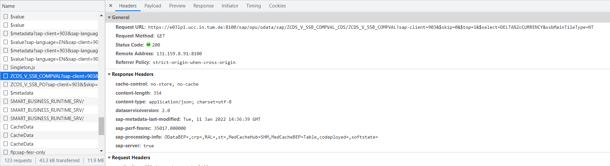
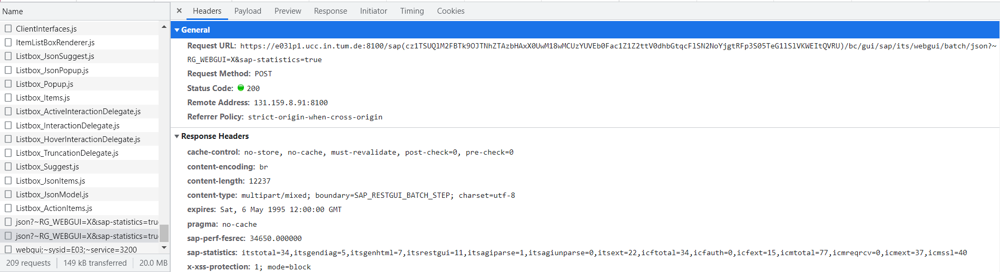

===================
Démarrage du projet 
===================

Le but du projet était de créer une Intelligence Artificielle capable de jouer et de gagner à *ERPSIM*. 

Pour ce faire, nous avons lu et mis de côté les informations importantes des guides d'utilisation fournis par HEC Montréal 
afin de faire un condensé des informations à retenir. Nous avons aussi joués plusieurs parties, pour se familiariser au 
fonctionnement du jeu, pour voir quelles données étaient présentes sur l'interface du jeu, mais aussi pour voir de quoi était 
composé le flux oData. En effet, le flux oData est le flux sur lequel nous extrayons les données. 

Etat de l'Art
-------------

Nous avons réalisé une introduction sur les méthodes employées pour créer une intelligence artificielle dans le cadre de la théorie des jeux. Nous n'avons pas détaillé les différentes méthodes utilisées dans ce cadre puisque nous avons laissé de côté cette éventualité suite à une étude plus approfondie du système ERPSIM. |br| 
Nous allons vous expliquer pourquoi.

^^^^^^^^^^^^^^^^^^^^^^
Reinforcement Learning
^^^^^^^^^^^^^^^^^^^^^^

Lorsque l'on aborde le sujet de l'intelligence artificielle permettant de battre l'intelligence humaine dans le cadre de jeux, nous pensons incontestablement à la défaite du champion du monde d'échec Kasparov contre une méthode d'intelligence artificielle en 1997. |br|
Nous pensons également au programme AlphaGo développé par DeepMind, ayant battu le champion du monde de Go en 2017. |br|
Ces méthodes utilise un sous-ensemble du domaine de l'intelligence artificielle appelé le `Reinforcement Learning <https://en.wikipedia.org/wiki/Reinforcement_learning>`_.

Nous avons donc effectué des recherches concernant ces méthodes. |br|
Nous allons vous expliquer rapidement l'objectif général de celles-ci afin de mieux comprendre ces problématiques. |br|
Le but du Reinforcement Learning est d'apprendre un comportement optimal ou presque optimal afin de maximiser la récompense reçue par le système (celle-ci étant déterminée par le développeur afin d'orienter l'apprentissage du système). |br|
L'agent intéragit avec l'environnement, il reçoit l'état de celui-ci, puis prend une décision parmi plusieurs actions possibles et reçoit suite à cet action, une récompense lui permettant par la suite d'adapter son comportement.

^^^^^^^^^^^^^^^^^^^^^^^^^^^^^^^^^^^^^^^^^^^^^^^^^^^^^^^^^^^^^^^^^^^^^^^
Contraintes nous ayant freinées dans l'emploi du Reinforcement Learning
^^^^^^^^^^^^^^^^^^^^^^^^^^^^^^^^^^^^^^^^^^^^^^^^^^^^^^^^^^^^^^^^^^^^^^^

Nous voyons donc que ces méthodes nécessitent de pouvoir intéragir avec un environnement. |br|
Notre environnement dans ce cas-ci, est l'environnement ERPSIM. Nous avons donc cherché comment intéragir avec celui-ci.

Tout d'abord, nous devons être capable de lancer via une instruction de code, le début d'une partie. |br|
Il y a alors une première contrainte puisque seul le professeur semble capable de pouvoir démarrer une partie.

Ensuite, nous devons être capable avec des instructions de code, d'effectuer une action sur l'environnement ERPSIM (ie. baisser le prix d'un produit). |br|
Nous avons alors cherché de quelle manière l'interface SAP Fiori intéragit avec SAP 4/HANA. |br|
L'interface ERPSIM développée à l'aide de SAP Fiori, semble intéragir avec SAP HANA via des services OData. |br| 
Cependant, sans avoir de spécifications concernant ces services et comment les utiliser, il est difficile de pouvoir programmatiquement intéragir avec SAP HANA directement. |br|
Nous avons essayé de faire du reverse engineering [#f2]_ de l'app Fiori, mais n'avons pas compris comment pouvoir intéragir directement avec SAP HANA. |br|
Nous pouvons récupérer les informations sur la partie via le flux OData fourni ou encore par les `CDS Views de SAP <https://help.sap.com/docs/SAP_HANA_PLATFORM/b3d0daf2a98e49ada00bf31b7ca7a42e/b4080c0883c24d2dae38a60d7fbf07c8.html?version=2.0.04&locale=en-US>`_. 

    *Reverse Engineering de la récupération des données de la Company Valuation*

Résultats de la requête :

.. code-block:: console

    {
        "d": {
            "results": [
                {
                    "__metadata": {
                        "id": "https://e03lp1.ucc.in.tum.de:8100/sap/opu/odata/sap/ZCDS_V_SSB_COMPVAL_CDS/ZCDS_V_SSB_COMPVAL('.10~EUR')",
                        "uri": "https://e03lp1.ucc.in.tum.de:8100/sap/opu/odata/sap/ZCDS_V_SSB_COMPVAL_CDS/ZCDS_V_SSB_COMPVAL   ('.10~EUR')",
                        "type": "ZCDS_V_SSB_COMPVAL_CDS.ZCDS_V_SSB_COMPVALType"
                    },
                    "CURRENCY": "EUR",
                    "DELTA": "1470997.90"
                }
            ]
        }
    }

On voit que SAP Fiori récupère les données de SAP 4/HANA via les CDS Views servies par un service OData.

Mais lorsqu'il s'agit d'effectuer des actions comme changer les prix des produits, nous n'avons pas réussi à cibler quelles requêtes effectuent ces actions avec certitude, ni comment les utiliser.

    *Reverse Engineering de l'action changement de prix*

Payload de la requête :

.. code-block:: console

    [
        {
            "content":"3.90",
            "post":"value/wnd[0]/usr/ssubUEBERSICHT_SUB1:SAPMV13A:3011/tblSAPMV13ATCTRL_D3011/txtKONP-KBETR[2,1]"
        },
        {
            "post":"action/304/wnd[0]/usr/subHEADER:SAPLV13F:0100/txtLV13F-VAKET3",
            "content":"position=0",
            "logic":"ignore"
        },
        {
            "post":"focus/wnd[0]/usr/subHEADER:SAPLV13F:0100/txtLV13F-VAKET3",
            "logic":"ignore"
        },
        {
            "post":"action/3/wnd[0]/tbar[0]/btn[11]"
        },
        {
            "get":"state/ur"
        }
    ]

Nous n'avons pas compris comment pouvoir utiliser ces requêtes pour comprendre comment intéragir avec SAP HANA.

Nous avons donc conclu, qu'il ne serait pas possible sans de plus amples connaissances sur SAP HANA et Fiori de pouvoir intéragir directement avec SAP HANA, et donc de développer un système d'intelligence artificielle par renforcement.

^^^^^^^^^^^^^^^^^^^^^^^^^^^^^^^^^^^^
Conclusion sur la méthode à employer
^^^^^^^^^^^^^^^^^^^^^^^^^^^^^^^^^^^^

Suite à ces conclusions, nous avons alors décidé de proposer une solution d'aide au joueur, qui lui permettrait d'avoir une vue plus concise de la situation de son entreprise, et de le conseiller sur les stocks à envoyer dans les différents entrepôts, ainsi que quels prix appliquer pour chaque produit dans le scénario Logistics Introduction, qui nous permet de proposer une première approche répondant à la problématique qui est de créer un système intelligent capable de jouer à ERPSIM.

.. _paramètres_jeu:

Les paramètres du jeu 
---------------------

Nous avons répertoriés les paramètres du jeu. Nous savons que nous pouvons agir sur les prix, les flux de transferts. En agissant sur ces derniers, 
nous influons les ventes et les stocks : 

.. figure:: ../_static/img/ParamètresERPSIM.png
    :align: center 
    :target: ../../_images/ParamètresERPSIM.png

    *Liste des paramètres d'entrées et de sortie du jeu ERPSIM*
