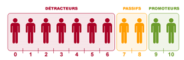

.. _evolution:

========================
Perspectives d'évolution
========================

Interaction avec le jeu 
-----------------------

Actuellement, le joueur, s'il suit tous nos conseils, se contente juste de reproduire ce qu'on lui dit de faire. 
Il reproduit sur le *serious game* les indicateurs que nous lui communiquons. Pour palier à cette situation, il serait possible, 
avec `Selenium <https://selenium-python.readthedocs.io/>`_, d'intéragir sur la plateforme du *serious game* directement. 

En effet, si nous paramétrons correctement tous les boutons et champs utiles du jeu, nous pourrions écrire un programme 
qui clique et remplit les champs en fonctions des sorties de notre programme actuel. Cela faciliterait donc la tâche du joueur. 

Notre programme pourrait alors, ne plus petre considéré comme une aide mais jouer tel un BOT. 

.. warning:: 

    Attention toutefois, il suffirait d'un petit changement sur la plateforme du jeu pour ce code ne soit plus fonctionnel. 
    Cette fonctionnalité aurait donc des limites très précoces. 

Pour le mieux, il faudrait pouvoir executer les transactions directement sur le jeux comme elles sont faites sur les 
navigateurs quand nous cliquons ou remplissons les champs. Après des recherches à ce propos, nous n'avons rien trouvé de probant,
qui plus est, dans le temps limite consacré au développement de notre projet. 

Il faudrait de plus amples connaissances sur SAP, pour évoquer cette éventualité. 

Estimer les prix avec le NPS Surveys
------------------------------------

Une donnée que nous ne traitons pas actuellement, surement à tort, est le NPS Surveys. Cette valeur, est transmise dans le flux oData via la table NPS Surveys. |br|
On retrouve, pour chaque jour, et pour chaque produit et pour chaque région -sous réserve qu'il y ait eu des ventes ce jour- le nombre de personnes ayant donné chaque score. 

^^^^^^^^^^^^^^^^^^^^^^
Qu'est ce que le NPS ?
^^^^^^^^^^^^^^^^^^^^^^

Le NPS [#f1]_ est un indicateur utilisé pour connaître la proportion de clients prêt à recommander une marque, un produit ou encore un service. Le score obtenu permet d’évaluer la satisfaction et la fidélité moyenne d’une clientèle. |br|
Le NPS est mesuré en recueillant des réponses à une question sous la forme « Quelle est la probabilité est-ce que vous recommanderiez le produit ou l’entreprise à un ami ou un collègue. Les réponses à cette question sont collectées à l'aide d'une échelle de Likert allant de 0 à 10. Dans l'interprétation du NPS, les répondants sont classés en trois groupes en fonction de leurs réponses : 

**1.	Groupe de promoteurs (9 à 10)**

    Ce sont des personnes qui ont une attitude positive envers les services ou les produits de l'entreprise. Les entreprises devraient essayer d'élargir cet ensemble de clients tout en conservant les clients existants dans ce groupe. 

**2.	Passifs (7 à 8)**

    Ces clients ont une attitude neutre envers l'entreprise focale. Ils sont plus susceptibles de fonder leurs décisions sur le prix et la qualité du produit ou du service. Les entreprises devraient essayer d'améliorer la qualité de leurs services afin que les passifs soient transformés en promoteurs. 

**3.	Détracteurs (1 à 6)**

    Ils ont une attitude négative envers l'entreprise et sont susceptibles d'utiliser d'autres marques ou de changer si l'occasion leur en est donnée. Les entreprises devraient trouver des moyens de réduire cet ensemble de personnes en résolvant les problèmes qui rendent certains clients mécontents.

    *Distribution du NPS*

^^^^^^^^^^^^^
Calcul du NPS
^^^^^^^^^^^^^

Le Net Promoter Score est calculé en prenant le pourcentage de promoteurs et en y soustrayant le pourcentage de détracteurs. Le NPS n’est pas exprimé en pourcentage, mais comme nombre absolu qui se situe entre -100 et +100.

:math:`NPS = \frac{\lvert Promoteurs \rvert - \lvert Detracteurs \rvert}{\lvert Promoteurs \rvert + \lvert Passifs \rvert + \lvert Detracteurs \rvert}`

Ou bien 

:math:`NPS = \% \, Promoteurs - \% \, Detracteurs`

^^^^^^^^^^^^^^^^^^^^^^^^^^
Interprétation du résultat
^^^^^^^^^^^^^^^^^^^^^^^^^^

* Si :math:`NPS < 0` Alors il y a plus de Détracteurs que de Promoteurs
* Si :math:`NPS = 0` Alors il y a autant de Détracteurs que de Promoteurs
* Si :math:`NPS > 0` Alors il y a plus de Promoteurs que de Détracteurs

Attention cependant à un NPS qui pourrait être positif, mais qui ne serait pas forcément représentatif : 

* Promoteurs : 20 
* Détracteurs : 10 
* Passifs : 70 

Alors :math:`NPS = \frac{Promoteur - Détracteurs}{Promoteurs + Détracteurs + Passifs} = \frac{20 - 10}{20 + 10 + 70} = \frac{10}{100} = 10 \, \%`. |br|
Le score est positif, cependant 70 personnes sont Passifs, ils ne recommandent pas la marque, mais ne la négligent pas non plus. On comprend donc bien, qu'un score positif ne suffit pas à être bon. 

Il faudrait donc analyser ces scores et voir si les ventes des jours suivants sont fonction de ce score sur les jours précédents. Si oui, alors, grâce à ce score, nous pourrions mieux prévoir les ventes des prochains jours. Ceci nous permettrait de mieux gérer les stocks, et les prix de manière à générer plus de profit. 

Passer à des scnéarios plus complexes
-------------------------------------

Pour démarrer, pour des questions de facilité, nous avons choisi de developper notre aide sur le scénario *Logistics Introduction*. 

Il faudrait donc maintenant, pouvoir proposer une aide, ou un BOT, sur les autres scénarios du jeu comme *Manufacturing* ou encore sur *Manufacturing Extended*. |br|
Ces scénarios reposent aussi sur la vente de produits, mais ils incluent plusieurs autres aspects, rendant le jeu plus réaliste mais aussi plus complexe. |br|
On peut noter par exemple, l'ajout d'une composante *CO2*, où il faut alors jouer aussi avec la taxe Carbone, ou alors une partie achat des matières premières, dans le but de programmer la fabrication des produits finis pour ensuite les vendre. |br|
Autant d'aspect que nous ne traitons pas avec le scénario actuel, qu'il serait judicieux de programmer pour que chaque étudiant, quelque soit le scénario joué, puisse bénéficier de notre aide. D'autant plus que la grande majorité des parties jouées à `Junia ISA <https://www.isa-lille.fr/isa-lille/>`_, sont des parties *Manufacturing*.

L'actualisation de l'interface du joueur 
----------------------------------------

Bien que les données soient récupérées du flux odata toutes les minutes de manière autonome, la page du joueur quant à elle 
n'est pas rafraîchie chaque minute : il faut cliquer sur `F5` ou sur le logo de rafraîchissement du navigateur pour voir les données 
et les graphiques s'actualiser. 

Nous pourrions donc prévoir un rechargement automatique de cette page afin que l'utilisateur n'ait pas besoin de le faire manuellement. 

Toutefois, pour limiter les risques, nous affichons clairement en grand, le *round* et le *day* en haut de page. De cette façon 
le joueur peut comparer ces valeurs à celles de l'interface du *Serious Game* pour savoir si les données présentées sont les dernières données. 

.. warning::

    Attention, sur l'interface du *Serious Game*, il faut aussi rafraîchir à la main le dashboard, les données ne sont pas actualisées
    automatiquement.

La robustesse de l'extraction des données
-----------------------------------------

.. rubric:: Notes

.. [#f2] `Reverse Engineering <https://en.wikipedia.org/wiki/Reverse_engineering>`_ : Processus visant à comprendre par déduction comment un logiciel accomplit une tâche avec peu d'informations sur comment celui-ci le fait.

.. [#f1] NPS : Net Promoter Score