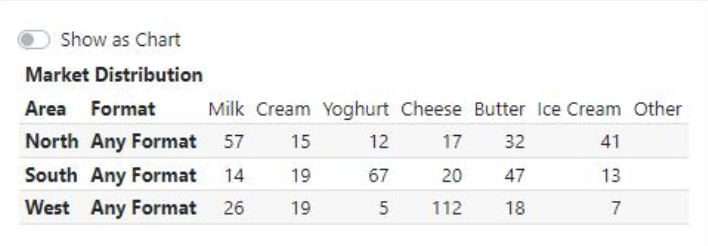
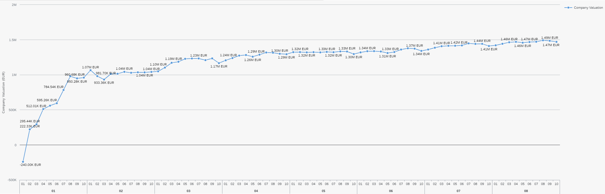
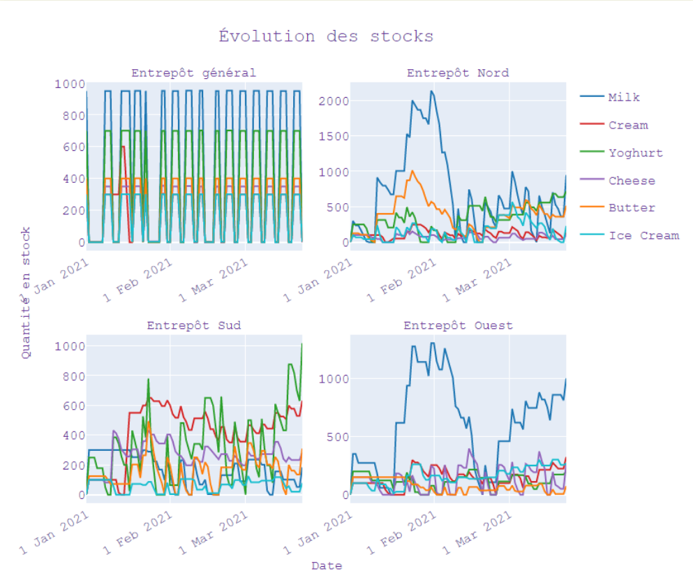

.. _resultats:

====================================
Résultats et Analyse de la stratégie
====================================

Les bénéfices pour l'utilisateur
--------------------------------

D'un point de vue visuel, nous pouvons trouver, sur :ref:`l'interface utilisateur <joueur>`, des conseils sur les prix, les transferts de stocks, et une vue plus générale 
de l'état de l'entreprise au premier coup d'oeil. Cette vue permet de prendre des décisions plus rapidement puisque toutes les informations sont centralisées.

D'un point de vue contenu, nous pouvons changer très rapidement les transferts de Stocks grâce au tableau présent en bas à gauche de la page 
car les lignes des produits sont dans le même ordre que dans le jeu, ainsi que les colonnes pour les régions. De ce fait, le joueur n'a plus 
qu'à recopier les valeurs présentes dans ce tableau. 

De la même manière, le tableau des prix, en bas à droite de la page, permet d'adapter les prix au plus vite. Attention toutefois à la latence 
qu'il peut y avoir entre ERPSIM et ERPSIM Helper. En effet, le temps que les données soient récupérées et affichées sur l'interface, il se peut 
qu'un jour soit passé sur ERPSIM. Il faut donc bien vérifier sur ERPSIM Helper, le Round et le Jour en cours, de manière à pas changer le prix 
deux fois. 

Méthode d'évaluation
--------------------

Afin d'évaluer notre solution, nous voulions tester de faire une partie avec :

* Un joueur débutant
* Un joueur disposant des graphiques
* Un joueur disposant des graphiques et de l'aide

Cependant, à notre retour pour effectuer la période de 2 semaines en mai, le professeur nous a informé que l'on ne pouvait plus lancer des parties avec plusieurs joueurs (car diminution de la licence lorsqu'il n'y a plus de cours).

Nous avons donc décidé de mesurer l'efficacité de notre solution de la manière suivante :

1. Nous jouons une partie le plus parfaitement possible en suivant l'aide, puis mettons à disposition nos résultats, afin qu'une future partie du scénario Logistics Introduction puisse être jouée avec les mêmes paramètres de marché pour voir l'efficacité de notre solution comparé à un joueur novice.

    *Ditribution du marché de la partie jouée*

2. Pour avoir une intuition de l'efficacité de notre solution, nous comparons nos résultats avec ceux d'un groupe d'étudiants de `Junia ISA <https://www.isa-lille.fr/isa-lille/>`_ dont nous avons pu récupérer les flux odata. |br| Ils jouaient sur un autre scénario avec celui sur lequel nous avons joué. Nous savons donc que ces conclusions sont à prendre avec parcimonie. Ils nous permettent, cependant, d'avoir une indication sur le comportement de notre programme, sans pour autant valider les résultats.

Résultats finaux
----------------

En termes de Company Valuation, nous pouvons voir ci-dessous, que cette dernière monte très vite au départ puis se stabilise à une bonne valeur. 

    *Company Valuation d'une partie jouée avec ERPSIM Helper*

On y voit donc que nous atteignons 1 million de Company Valuation au Jour 4 du Round 2, et nous ne repassons plus jamais en dessous dans le reste de 
la partie. Au terme de la partie, nous réussissons à avoir 1.47 millions de Company Valuation avec un pic à 1.49 millions au jour 8 du Round 8. 

1. Par rapport aux autres parties que nous avons pu jouer au cours de ce projet, c'est largement cette partie qui a été la mieux jouée avec la meilleure Company Valuation. Notre aide paraît donc fiable. 

2. Qui plus est, nous avons comparé notre score aux parties des étudiants de `Junia ISA <https://www.isa-lille.fr/isa-lille/>`_. Nous sommes bien conscients que nous jouons à ERPSIM avec le scénario Logistics Introduction et que les autres étudiants jouent au scénario Extended et que la difficulté n'est pas la même, mais nous arrivons, avec ce score, à nous placer 3ème du classement. |br| Ce dernier résultat est vraiment à prendre avec précaution, le calcul de la Company Valuation n'est pas le même dans ces deux scénarios. De plus, nous ne savons pas si la Company Valuation est "plafonnée" par un jeu parfait, qui pourrait différer en fonction des variables initiales de la partie. |br| Cette remarque est donc là pour information, plus que pour montrer l'intérêt de notre solution.

Analyse de la stratégie
-----------------------

    *Etat des entrepôts lors de la partie jouée avec ERPSIM Helper*

Notre stratégie nous permet de ne pas accumuler de stock dans l'entrepôt général. 

Concernant les entrepôts régionaux, nous pouvons voir que la majorité des stocks sont bien gérés. |br|
Cependant, nous constatons que certains produits semblent saisonniers (i.e Milk), nos calculs permettant de savoir quelle quantité envoyer dans chaque région est basé sur les ventes depuis le début de la partie. |br| 
La stratégie ne prend donc pas en compte les effets saisonniers, on voit alors qu'après une période de forte vente dans l'Ouest, le Milk est réapprovisionné à tort dans l'Ouest.

Sur la Company Valuation, la stratégie semble bonne, même si elle peut sûrement être perfectionnée, en anticipant de manière plus intelligente, les variations de la demande Client. Une des pistes possible est d'exploiter les NPS Surveys.

**Lecture suivante**

Prochaine section : :doc:`DifficultesRencontres`.