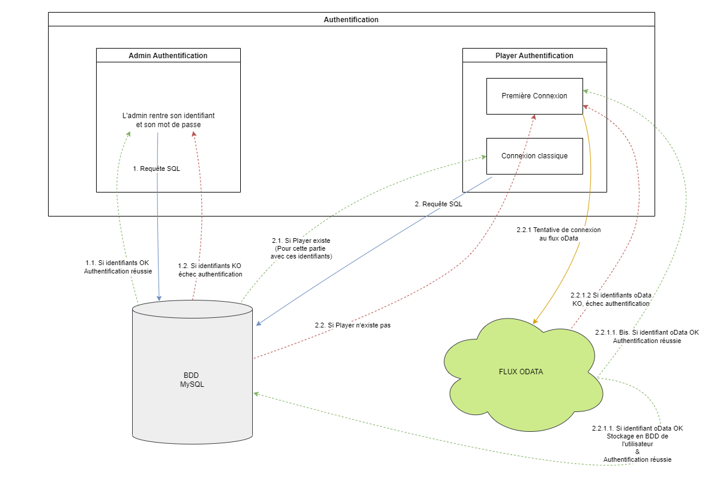

.. _fonctionnement:

Architecture
============

.. note::
   Partie plus technique, schéma architectural du projet, différentes technologies mises en jeux et leurs intercommunications ?    

Ce projet est composé de 3 grandes parties. 

* L'authentification, que ce soit de l'enseignant ou des élèves. 
* Les flux de données afin de les extraire du flux oData pour les stocker dans une base de données MySQL hébergée en ligne. 
* Récupérer les données de la base, pour les traiter et en faire des informations pertinentes quant à la situation actuelle de votre entreprise mais aussi pour faire des prédictions. 

.. _authentification:

==================
L'authentification 
==================

L'authentification est une étape importante dans le projet puisque la récupération des données sur le flux oData 
dépend de cette authentification. En effet, pour vous connecter à notre projet, vous utilisez vos identifiants du jeu 
ERPsim.

   *Schéma du fonctionnement de l'authentification* 

Comme c'est montré ci-dessus, il faut gérer l'authentification de l'administrateur mais aussi celle de l'étudiant. Dans un premier
temps, pour vérifier l'identiant de l'administrateur.

^^^^^^^^^^^^^^^^^^^^^^^^^^^^^^^^^^^^
Authentification de l'administrateur
^^^^^^^^^^^^^^^^^^^^^^^^^^^^^^^^^^^^

Une requête SQL ext éxécutée vers notre base. Si le profil n'existe pas, un `None`
est renvoyé, sinon c'est l'objet `user` qui est renvoyé. Dans ce dernier cas, la connexion est effective. 

^^^^^^^^^^^^^^^^^^^^^^^^^^
Authentification du joueur
^^^^^^^^^^^^^^^^^^^^^^^^^^

Ensuite, c'est à l'étudiant de se connecter. A ce moment là, deux situations peuvent survenir. 

.. _premiere_connexion:

""""""""""""""""""
Première connexion
""""""""""""""""""

Soit l'étudiant se connecte pour la première
fois, le compte n'existe donc pas en base. Alors, le programme récupère les informations rentrés dans le :ref:`formulaire d'authentification<connexion_joueur>`.
pour les tester sur le flux oData. Si la connexion fonctionne, alors l'utilisateur est sauvegardé en base de données, sinon, le programme
renvoie `None`.

"""""""""""""""
Nième connexion
"""""""""""""""

Soit l'étudiant ne se connecte pas pour la première fois, à ce moment là, son compte existe en base. Le programme compare donc 
alors les informations rentrés dans le :ref:`formulaire d'authentification<connexion_joueur>` avec les informations qui ont été 
sauvegardés lors de sa première connexion. Si les informations correspondent, alors il est connecté, le programme renvoie son `user`, sinon, le programme renvoie
`None`

.. _extractiondata:

===============================
L'extraction des données brutes 
===============================

La connexion de l'étudiant à son espace d'aide, lance le programme de rechargements de données. 

   *Schéma du fonctionnement de l'extraction des données brutes*

Comme montré ci-dessus, des tâches de rechargements sont générés et stockés dans un Redis [#f1]_. Une tâche va extraire les données 
d'une seule table oData, pour une seule équipe. Il y a donc la même tâche prévue toutes les minutes. Et chaque minute on lance autant de tâches
qu'il y a de tables. 

Les données sont extraites du flux oData auquel les informations d'identifications ont déjà été :ref:`vérifiés<premiere_connexion>`.
Ces données, une fois extraites, sont sauvegardées dans une base de données MySQL hébergée en ligne. 

Ces tâches sont toutes créées à la connexion de l'étudiant. De ce fait, si la partie est mise en pause par l'enseignant, 
les tâches doivent être arrêtées. Pour ce faire les tâches sont alors annulées. Lorsque l'enseignant remettra le jeu en route,
alors les tâches seront recréées de manière à ce que les données soient bien rechargées jusqu'à la fin de la partie. 

.. _traitements_affichages:

=========================
Traitements et affichages
=========================

Une fois que les données sont stockées en base, elles sont utilisées pour être traitées puis afficher sur l'interface d'aide du
joueur. 

   *Schéma du fonctionnement des traitements et de l'affichage*

.. [#f1] Redis : Redis est un système de gestion de base de données *(Wikipédia)*

=============
What's Next ?
=============

Dans la :ref:`section suivante<code_source>`, vous retrouverez le code source du projet. 