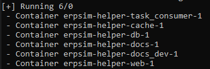

.. _installation:

Installation
============

.. note::
    Requierements – qu'est-ce qu’il faut installer ? Comment l’installer ? Comment lancer le projet ?  

.. note::

    Expliquer comment installer sur un serveur. Prévoir si nous nous occupons plus du projet. 
    
.. _Lancement_general:

=======
Langage 
=======

Ce projet a été développé en Python, car ce langage est facile d'utilisation, très bien documenté et doté de nombreuses librairies 
très complètes et elles aussi très bien documentées. 

Pour installer Python, rendez-vous sur le `site officiel <https://www.python.org/downloads/>`_ de Python. Pour information, ce projet a été développé avec Python 3.9.

De nombreuses librairies ont été utilisées pour faire communiquer les parties entres elles. Vous pouvez retrouver les différents
:ref:`packages <packages>` utilisés ci-dessous.

.. _packages:

========
Packages
========

Les différents packages utilisés sont :

.. literalinclude:: ../../../../requirements.txt

======================      =======     ============================================================================
Packages                    Version     Utilité
======================      =======     ============================================================================
Django                      3.2.11      Pour les interfaces admin et player
python-dotenv               0.19.2      Package système pour les identifiants et mots de passe
python-dotenv[cli]          0.19.2      Package système pour les identifiants et mots de passe
huey                        2.4.3       Pour gérer les tâches pour les rechargements
redis                       4.1.0       Pour stocker les tâches de rechargements
mysql-connector-python      8.0.26      Pour stocker les données dans la base de données MySQL
pyodata                     1.7.1       Pour extraire les données du flux oData
requests                    2.23.0      Utilisé avec les sessions dans le cadre de la recupération des données oData
======================      =======     ============================================================================

======
Docker 
======

Télécharger Docker Desktop 
--------------------------

Pour faciliter le lancement de ce projet, nous avons mis en place Docker. En effet, il permet de lancer ce projet avec une simple ligne de commande. 
Vous pouvez le `télécharger <https://desktop.docker.com/win/main/amd64/Docker%20Desktop%20Installer.exe?utm_source=docker&utm_medium=webreferral&utm_campaign=dd-smartbutton&utm_location=module>`_ gratuitement. 

Si, lorsque vous lancez Docker Desktop, une erreur s'affiche concernant le WSL, cliquez sur le `lien fournit <https://docs.microsoft.com/fr-fr/windows/wsl/install-manual#step-4---download-the-linux-kernel-update-package>`_
dans le message d'erreur.

Erreur WSL [#f1]_ 
-----------------

.. note::

    Si vous n'avez pas eu l'erreur citée précédemment, ne prenez pas en compte cette partie. 

1. `Téléchargez <https://wslstorestorage.blob.core.windows.net/wslblob/wsl_update_x64.msi>`_ le package de Mise à jour du noyau Linux WSL2 pour machine x64
2. Une fois téléchargé, éxécutez le fichier en double cliquant dessus. 
3. Ouvre une commande Windows Power Shell et éxécutez la commande ci-dessous 

.. code-block:: console 

    wsl --set-default-version 2

4. Redémarrez l'ordinateur et le problème ne doit plus apparaître. 

Lancement de Docker Compose 
---------------------------

Dans une invite de commande (cmd) allez dans le répertoire ERPsim-helper

.. code-block:: console
    
    cd C:/*votre chemin*/ERPsim-helper

Une fois dans le dossier, tapez la ligne de commande suivante 

.. code-block:: console 

    docker-compose build

Cette commande éxécute le fichier `requirements.txt` pour installer toutes les dépendances
nécessaires au bon fonctionnement du projet. 
Il construit aussi les `containers` correspondant aux différents services et les lance.

Pour lancer uniquement la partie documentation, il faut taper la commande suivante 

.. code-block:: console 

    docker-compose run --rm --service-ports docs_dev

Pour lancer tous les `containers` en une fois, il suffit de taper la commande suivante 

.. code-block:: console 

    docker-compose up

Services éxécutés
-----------------

===============     ==============     =======================================================================
Services lancés     Nom du service     Rôle                                                                    
===============     ==============     =======================================================================
BDD MySQL           db                 Connexion et flux avec la BDD                                           
Django Server       web                Interfaces Administrateur et étudiant                                   
Huey                task_consumer      Création et gestion des tâches                                          
Redis               cache              Stockage des tâches de huey                                             
Documentation       docs_dev           Générer la documentation à chaque modification pendant le développement 
Documentation       docs               Build la documentation au lancement                                     
===============     ==============     =======================================================================

    *Ensemble des containers éxécutés par Docker Compose*

Docker installe lui-même toutes les librairies nécessaires grâce au fichier `requirements.txt`. 

.. [#f1] `Documentation Microsoft <https://docs.microsoft.com/fr-fr/windows/wsl/install-manual#step-4---download-the-linux-kernel-update-package>`_

**Lecture suivante**

Prochaine section : :doc:`Architecture`.