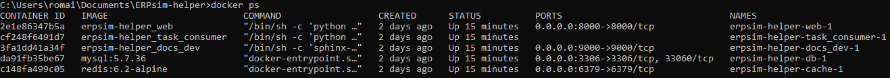
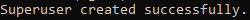
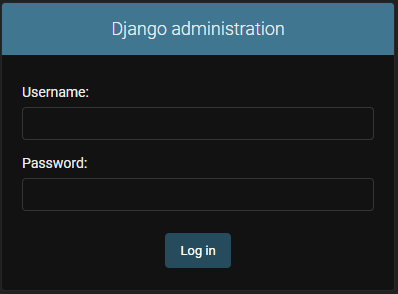
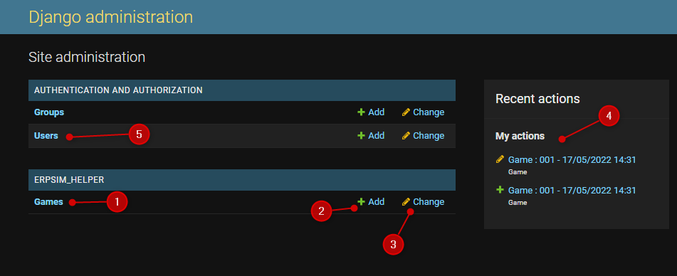
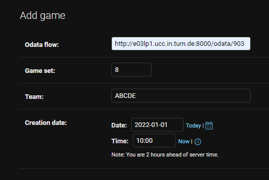
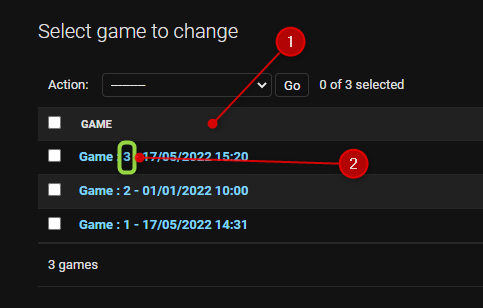

.. _administrateur:

=====================
Partie administrateur
=====================

L'administrateur, contrairement à l'étudiant, doit avoir un compte créé au préalable. 

Création du compte Admin 
------------------------

Pour créer le compte administrateur, il vous faut entrer quelques lignes de commandes. 

La première, vous permettra de voir tous les `containers` Docker du projet 

.. code-block:: console 

   docker ps 

Vous devez obtenir une lite comme celle-ci à l'exception près des id des `containers`. 

   *Liste des containers Docker*

.. _id_container:

Veuillez maintenant copier l'id du `container` nommé `web`. Le nom du container correspond à la deuxième colonne 
appelée `IMAGE` dans les logs, l'id se trouve, quant à lui, dans la première colonne. Ici son id est le *2e1e86347b5a*

Il vous faut maintenant aller dans le dossier du `container` en éxécutant la commande suivante et en remplaçant 
`CONTAINER_ID` par l'id que vous avez :ref:`relevé ci-dessus <id_container>`. 

.. code-block:: console 

   docker exec -it CONTAINER_ID /bin/sh

Ensuite, éxécutez la commande suivante et suivez les instructions. 

.. code-block:: console 

   python django_server/manage.py createsuperuser

Si vous avez bien effectué la procédure, vous devez avoir le message suivant. 

   *Si la procédure s'est bien déroulée*

Utilisation de l'interface administrateur
-----------------------------------------

.. _connexion_admin:

Connexion
^^^^^^^^^

Une fois que le compte administrateur est créé, il peut se rendre sur la `page de connexion <http://127.0.0.1:8000/admin/>`_
admin.

   *Page de connexion administrateur*

Une fois fait, il arrive sur la page d'accueil de l'interface admin. 

Interface des parties jouées
^^^^^^^^^^^^^^^^^^^^^^^^^^^^

   *Page d'accueil de l'administrateur*

On y trouve en 

1. Un bouton pour accéder à l'historique des parties jouées.
2. Un bouton pour créer une nouvelle partie.
3. Ce bouton revient au même que le 1., il permet d'accéder à l'historique des parties.
4. Un résumé de vos dernières actions. 
5. Un bouton permettant d'accéder à tous les utilisateurs qui se sont déjà connectés au moins une fois. 

Création d'une partie
^^^^^^^^^^^^^^^^^^^^^

Pour créer une partie il faut renseigner 5 informations : 

1. Le lien du flux odata.
2. Le Set sur lequel la partie est jouée.
3. Les équipes en jeu. Toutes les lettres collées. Par exemple, si les équipes A, B, C, D et E sont en jeu, il faut remplir "ABCDE". 
4. La date de début de la partie jouée. 
5. L'heure de début de la partie jouée. 

Voici un exemple : 

   *Interface de création d'une partie*

.. _id_partie:

L'ID de la partie en cours
^^^^^^^^^^^^^^^^^^^^^^^^^^

Quand la partie est créée, il faut communiquer aux étudiants l'ID de la partie pour leur permettre
de se connecter à leur tour. L'ID est, dans l'historique des parties jouées *[1]*, le numéro après le 
mot "Game" *[2]*. 

A ce moment là, le programme se met en marche automatiquement et récupère les données du flux odata
toutes les minutes. 

(Voir :ref:`ici <fin_de_partie>` les conditions d'arrêts)

   *Interface Games - Historique des parties jouées et en cours*

.. _Au_cours_d_une_partie:

Au cours d'une partie 
^^^^^^^^^^^^^^^^^^^^^

Au cours d'une partie, l'enseignant peut la mettre en pause en utilisant le bouton prévu à cet effect
en bas à droite de la fenêtre de détails de la partie. 

Il pourra, bien entendu, la relancer via le bouton "Play" lorsque la partie reprendra. 

.. _fin_de_partie:

La fin d'une partie 
^^^^^^^^^^^^^^^^^^^

La fin d'une partie peut-être déclenchée par 3 moyens 

1. Nous avons atteint le Jour 10 du Round 8, la partie s'arrête. 
2. L'enseignant clique sur le bouton "Stop", la partie s'arrête. 
3. La partie a été lancée il y a plus de 7 jours, le programme considère que c'est un oubli et la partie est arrêtée.  

**Lecture suivante**

Prochaine section : :doc:`Joueur`.