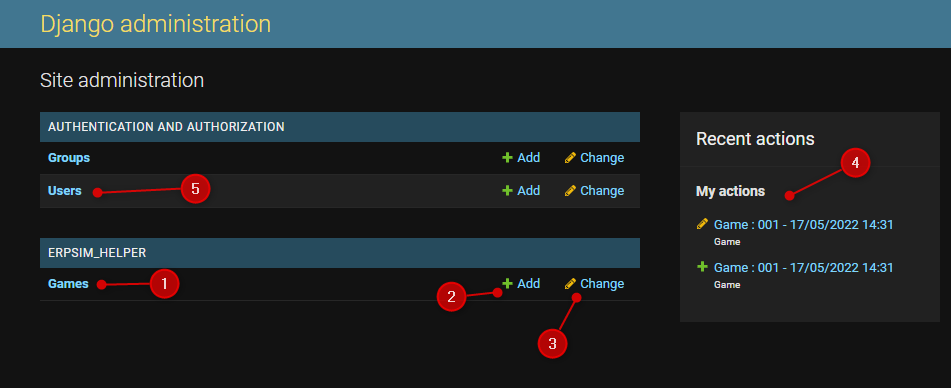
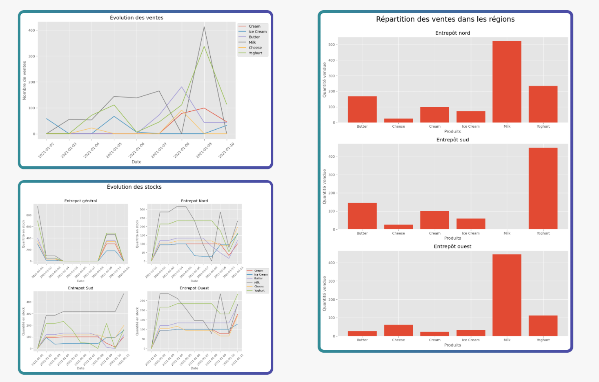

.. _usage:

Usage
=====

.. note::
   Comment utiliser le projet ? Se connecter, utiliser l’application  

Ce projet se lance en 2 parties. La première doit être effectué par l' :ref:`enseignant <administrateur>`. Une fois fait, l'étudiant peut alors accéder à son
:ref:`espace <joueur>`. 

.. _administrateur:

=====================
Partie administrateur
=====================

L'administrateur, contrairement à l'étudiant, doit avoir un compte créé au préalable. 

Création du compte Admin 
------------------------

Pour créer le compte administrateur, veuillez contacter un des développeurs. Les adresses
mails des développeurs sont disponibles sur :ref:`ce lien <developpeurs>`. 

Utilisation de l'interface administrateur
-----------------------------------------

.. _connexion_admin:

^^^^^^^^^
Connexion
^^^^^^^^^

Une fois que le compte administrateur est créé, il peut se rendre sur la `page de connexion <http://127.0.0.1:8000/admin/>`_
admin.

.. figure:: _static/img/InterfaceConnexionAdmin.png
   :align: center
   :target: _images/InterfaceConnexionAdmin.png

   *Page de connexion administrateur*

Une fois fait, il arrive sur la page d'accueil de l'interface admin. 

^^^^^^^^^^^^^^^^^^^^^^^^^^^^
Interface des parties jouées
^^^^^^^^^^^^^^^^^^^^^^^^^^^^

   *Page d'accueil de l'administrateur*

On y trouve en 

1. Un bouton pour accéder à l'historique des parties jouées.
2. Un bouton pour créer une nouvelle partie.
3. Ce bouton revient au même que le 1., il permet d'accéder à l'historique des parties.
4. Un résumé de vos dernières actions. 
5. Un bouton permettant d'accéder à tous les utilisateurs qui se sont déjà connectés au moins une fois. 

^^^^^^^^^^^^^^^^^^^^^
Création d'une partie
^^^^^^^^^^^^^^^^^^^^^

Pour créer une partie il faut renseigner 5 informations : 

1. Le lien du flux odata.
2. Le Set sur lequel la partie est jouée.
3. Les équipes en jeu. Toutes les lettres collées. Par exemple, si les équipes A, B, C, D et E sont en jeu, il faut remplir "ABCDE". 
4. La date de début de la partie jouée. 
5. L'heure de début de la partie jouée. 

Voici un exemple : 

.. figure:: _static/img/InterfaceCreationGameAdmin.png
   :align: center
   :target: _images/InterfaceCreationGameAdmin.png

   *Interface de création d'une partie*

.. _id_partie:

^^^^^^^^^^^^^^^^^^^^^^^^^^
L'ID de la partie en cours
^^^^^^^^^^^^^^^^^^^^^^^^^^

Quand la partie est créée, il faut communiquer aux étudiants l'ID de la partie pour leur permettre
de se connecter à leur tour. L'ID est, dans l'historique des parties jouées *[1]*, le numéro après le 
mot "Game" *[2]*. 

A ce moment là, le programme se met en marche automatiquement et récupère les données du flux odata
toutes les minutes. 

(Voir :ref:`ici <fin_de_partie>` les conditions d'arrêts)

.. figure:: _static/img/InterfaceGamesAdmin.png
   :align: center
   :target: _images/InterfaceGamesAdmin.png

   *Interface Games - Historique des parties jouées et en cours*

.. _Au_cours_d_une_partie:

^^^^^^^^^^^^^^^^^^^^^
Au cours d'une partie 
^^^^^^^^^^^^^^^^^^^^^

Au cours d'une partie, l'enseignant peut la mettre en pause en utilisant le bouton prévu à cet effect
en bas à droite de la fenêtre de détails de la partie. 

Il pourra, bien entendu, la relancer via le bouton "Play" lorsque la partie reprendra. 

.. _fin_de_partie:

^^^^^^^^^^^^^^^^^^^
La fin d'une partie 
^^^^^^^^^^^^^^^^^^^

La fin d'une partie peut-être déclenchée par 3 moyens 

1. Nous avons atteint le Jour 10 du Round 8, la partie s'arrête. 
2. L'enseignant clique sur le bouton "Stop", la partie s'arrête. 
3. La partie a été lancée il y a plus de 7 jours, le programme considère que c'est un oubli et la partie est arrêtée.  

.. _joueur:

=============
Partie Joueur
=============

Utilisation de l'interface joueur
---------------------------------

.. _connexion_joueur:

^^^^^^^^^
Connexion
^^^^^^^^^

Pour vous `connecter <http://127.0.0.1:8000/login/>`_, il suffit de vous identifier avec votre nom d'équipe *(eg : M_1)*, avec 
votre mot de passe utilisé sur le jeu ERPsim et le :ref:`numéro de la partie <id_partie>` en cours communiqué
par l'enseignant. 

.. warning:: 
   Le mot de passe par défaut sur ERPsim est *ERPsim*, il vous a été demandé de le 
   changer lors de votre première connexion au jeu. Pour accéder à l'aide, il faut bien entrer
   le NOUVEAU mot de passe que vous avez saisi. 

.. note:: 
   N'importe quelle personne de l'équipe peut se connecter à l'aide. Par contre, il ne peut
   y avoir qu'une seule connexion à l'aide par équipe en simultané.

Quand l'utilisateur se connecte, il est redirigé vers une `page <http://127.0.0.1:8000/admin/>`_ où il trouvera toutes les
informations utiles pour l'aider à jouer. 

Il pourra alors choisir entre avoir une vue sur des :ref:`recommandations <interface_recommandations>` ou une vue
sur les :ref:`évolutions de l'entreprise <interface_evolution>`.

.. note::   
   Ces pages sont mises à jour chaque minute, après chaque jour joué dans la simulation.

.. _interface_joueur:

.. _interface_recommandations:

^^^^^^^^^^^^^^^^^^^^^^^^^
Interface Recommandations
^^^^^^^^^^^^^^^^^^^^^^^^^

   *Partie Recommandations et Conseils*

On voit, en haut de page, les conseils donnés aux joueurs. 

Le tableau en bas à gauche montre la répartition du marché. Ces valeurs sont des valeurs proportionnelles.

Par exemple, pour le lait, nous avons 33 au Nord, 7 pour le Sud et 9 pour l'Est. C'est a dire que pour 9 laits vendus à l'Est, 
nous en vendrons 33 dans le Nord. Cette matrice donne une idée du volume de ventes par région. 

Pour le tableau de droite, le tableau des prix, les valeurs sont les valeurs de ventes conseillées. La colonne tendance et la colonne
prévision indique la même chose. 

Par exemple, pour le produit "Cream", nous avons une tendance de 1.05, cela indique qu'il faut augmenter le prix d'un facteur de 1.05, ce qui donne le prix 
indiqué dans la colonne à droite, "Prévisions". *(Prix de base 87.76 €, augmentation de 1,05 => 87.76 * 1.05 = 92.15)*

.. _interface_evolution:

^^^^^^^^^^^^^^^^^^^
Interface Evolution
^^^^^^^^^^^^^^^^^^^

   *Partie Evolution*

Dans cette partie, on retrouve des graphiques quant aux stocks dans les différents entrepôts au fil des jours. On y trouve aussi 
la répartition des ventes par produit et par zone, mais aussi la répartition des ventes par produit au fil des jours simulés. 

Vous aurez ainsi, une vue d'ensemble sur l'état de l'entreprise, et pourrez prendre les meilleurs choix pour faire augmenter votre 
company valuation. 

=============
What's Next ?
=============

Dans la :ref:`section suivante <fonctionnement>`, vous retrouverez le fonctionnement général du projet. 