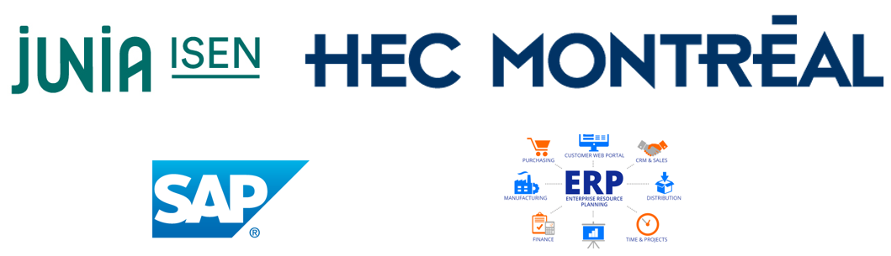

.. ERPsim documentation master file, created by
   sphinx-quickstart on Mon May 16 16:08:00 2022.
   You can adapt this file completely to your liking, but it should at least
   contain the root `toctree` directive.

.. _Accueil:

ERPsim Helper Documentation
==================================

   *Acteurs de ce projet*

**ERPsim helper** est une aide pour le jeu *ERPsim* développé par `HEC Montréal <https://www.hec.ca/>`_. 
Ce projet se place dans le cadre d’une observation lors de la Coupe du monde d’ERP. Lors de cette dernière, 
plusieurs équipes se sont affrontées sur ERPsim, un jeu sur la gestion d’entreprise. L’une de ces équipes n’était ni plus ni moins qu’un BOT [#f1]_. 

Contre toute attente, c’est le BOT qui a gagné la compétition devant l’ISA et les autres participants. C’est de là qu’est venue l’idée de développer 
une Intelligence artificielle capable d’apprendre à jouer mais aussi capable de gagner cette compétition en réagissant aux différents évènements du jeu. 

Ce jeu repose sur SAP, un ERP indispensable aux entreprises de nos jours.

ERP (Enterprise Ressource Planning ou Progiciel de Gestion Intégré en français)
   Dans le principe, un ERP est un logiciel permettant de gérer l’ensemble des processus opérationnels d’une entreprise, que ce soit la gestion des ressources humaines, 
   la gestion comptable et financière, mais aussi la vente, la distribution, l’approvisionnement ou encore les nouveaux besoins comme le commerce électronique. 

.. note::

   Ce projet est encore en développement.

Check out the :doc:`PartieUtilisateur/Joueur` section for further information, including how to
:ref:`install <installation>` the project.

.. _contents:

.. toctree::
   :caption: Histoire du Projet

   HistoireProjet/DemarrageProjet
   HistoireProjet/ConstructionStrategie
   HistoireProjet/DeveloppementErpsimHelper
   HistoireProjet/ResultatsProjet
   HistoireProjet/DifficultesRencontres
   HistoireProjet/PerspectivesEvolution

.. toctree::
   :caption: Tutoriels

   PartieUtilisateur/Administrateur
   PartieUtilisateur/Joueur

.. toctree::
   :caption: Technique

   PartieTechnique/Installation
   PartieTechnique/Architecture
   PartieTechnique/CodeSource
   PartieTechnique/Deploiement

.. toctree::
   :caption: A propos du projet
   
   CadreProjet

Indices and tables
==================

* :ref:`genindex`

.. rubric:: Notes

.. [#f1] BOT : Agent informatique capable de jouer en autonomie

================
Lecture suivante
================

Prochaine section : :doc:`HistoireProjet/DemarrageProjet`.